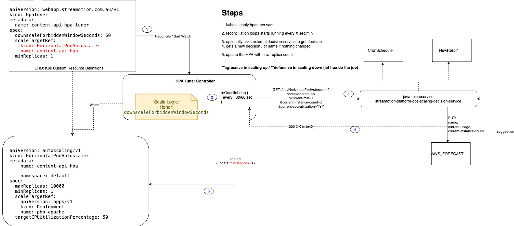

#streamotion-platform-ops-scaling-decision-service

# Overview

While K8s hpa-Controller works quite well, it lacks some of the controls that is useful for Streamotion use-cases:
1. Customize Scaledown Behaviour (EKS doesn't allow to override the default 5 min cooldown period)
1. More aggressive Scale-up Behaviour depending on the time (Sports fans are more active during the night)
1. Scheduled / predictive scaling...ok this is not HPA's fault :)

In summary, HPA works well when the load is gradually increasing, but customer experience suffers when we see massive spike in the network. This is specially true for sports viewers where everyone jumping in the website exactly on the same time. 

Traditionally we have addressed this issue by:
1. running tons of extra PODs to handle the extra load
1. trigger HPA scale-up from very LOW CPU (waste of server resource)
1. Run lower-priority dummy pod to keep AWS EC2 instance in pool so the higher priority pods can kick them out and scale in matter of seconds not 10 min aws ec2 spinup time
1. finally some operator (human) going in and up/down the HPA min based on the major game schedule that we know in advance.
     
Despite all that effort, we noticed 1-4 min degradation in our customer experience (api response time crossing 2 sec) during major game events. 


# Solution
After much internal discussion, we decided to take matters into our own hand and implement an operator to replace the human operator. 
Staying true to the operator framework mantra: 

**The Operator pattern aims to capture the key aim of a human operator who is managing a service or set of services. Human operators who look after specific applications and services have deep knowledge of how the system ought to behave, how to deploy it, and how to react if there are problems.
People who run workloads on Kubernetes often like to use automation to take care of repeatable tasks. The Operator pattern captures how you can write code to automate a task beyond what Kubernetes itself provides.**

## Some key Design Decision
1. The Operator should be of minimal impact, in otherwords, it will try to re-use existing k8s constracts and leverage all the community work put behind HPA Controller
1. Operator will only update the minimal count of HPA resource so HPA can still decide to scale further UP based on the load that we didn't predict 
1. Operator should be aggressive in scaling-up and defensive in scaling down 
1. We would take this opportunity to inject scheduling logic in the operator and in future even use machine learning to predict demand 
1. Given our team maturity of Java and building microservices, we decided to keep the core decision logic out of the operator  
1. We **MUST HAVE** solid test coverage and e2e automation on the GO codebase given our lack of experience in GO so it should be as low touch as possible

 


# How to start
How to start in command line and in IDE (Manual Testing).

1.
    NOTE: 
    ```
        if you are working on this project, watch this video a few times: https://www.youtube.com/watch?v=wMqzAOp15wo&t=1227s
        
    ``` 
   Setup your dev environment. Install:     
   ```
        kind (tested with version 0.9.0)
        make 
        ginkgo
    ```
    refer to : [Dockerfile](doc/docker-builders/Dockerfile-dind-kubernetes-container) for installation instruction
1. Start Your local k8s server and test resources (via kind)
    ```
        make kind-test-setup
    ```
1. Run Tests
    ```
        make kind-tests
    ```
1. Generate some load:
```
    cd test-data/phpload
    ./run_load.sh 
```

TBD: GO setup in visual-studio-code details / links: What IDE configurations required 

# External dependencies

NOTE: IntelliJ seems to have better support than visualstudio code for GO

# Outbound calls
Optionally use decision service
```
https://github.com/fsa-streamotion/streamotion-platform-ops-scaling-decision-service.git
```

# Business logic
1. if the hpa.minReplicas should be always equal to or greather than hpa-tuner.minReplicas
2. if hpa.desiredReplicas is scaled up because of load, hpa.minReplicas will be updated to match desiredReplicas 
    * (this is to prevent k8s to scale down the hpa.desiredReplicas before hpa-tuner.downscaleForbiddenWindowSeconds)
    * if hpa-tuner.downscaleForbiddenWindowSeconds is elapsed and hpa is not busy (cpu < 5%), hpa.minReplicas will be set back to hpa-tuner.minReplicas 
3. there will be no cool-down activity (decreasing hpa.minReplica) as long as hpa is busy (cpu > 5%)
4. alway pick the larger scaling number between decision-service.count & hpa.desiredReplicas
5. if recently downscaled, wait until hpatuner.spec.UpscaleForbiddenWindowAfterDownScaleSeconds before scaling up hpa.min 
6. TBD. pls add more logic / helper instructions for testing.
   

# References
The project scaffold is generated from : https://book.kubebuilder.io/ 

The CRD is generated from the `hpatuner_types.go`, if you change it, re-run make 

    best reference project (clean + functional tests): https://github.com/microsoft/k8s-cronjob-prescaler.git
    https://itnext.io/taking-a-kubernetes-operator-to-production-bc59708db420
    https://itnext.io/testing-kubernetes-operators-with-ginkgo-gomega-and-the-operator-runtime-6ad4c2492379
    https://github.com/kubernetes-sigs/controller-runtime/blob/master/pkg/client/example_test.go
    https://sdk.operatorframework.io/docs/golang/references/client/

TODO:
- [ ] paramaterize reconcile loop timer 
- [ ] set logging to info only when hpa is making changes
- [ ] there is a null error in the log
     
